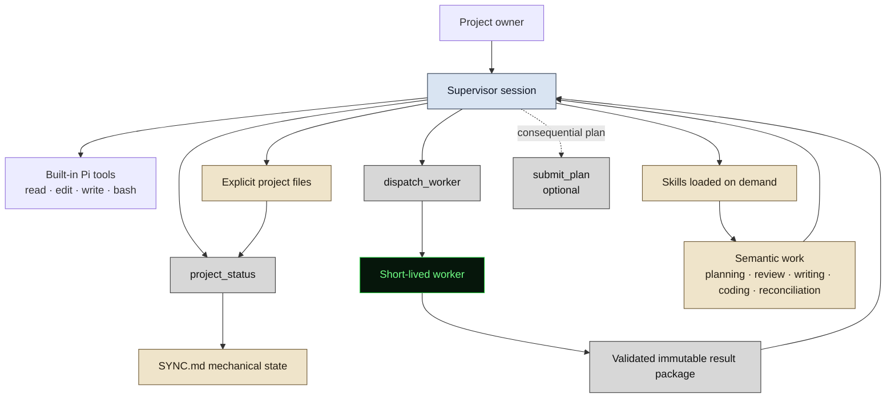
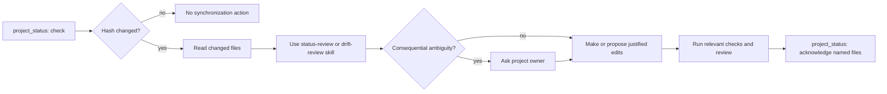

# Pi Sych: Redefined Minimal Architecture

**Status:** Proposed target architecture
**Intent:** Preserve Pi Sych's useful substrate while reducing its agent-facing and programmatic surface to the minimum required for explicit project state, bounded delegation, and human-owned judgment.

## 1. Purpose

Pi Sych is a small Pi package for serious writing, research, analysis, and software work.

It provides:

- explicit, inspectable project state;
- a minimal synchronization mechanism for detecting changed files;
- bounded, clean-context worker dispatch;
- reusable skills for interpretive workflows;
- optional human review through Plannotator.

Pi Sych does **not** attempt to encode scientific judgment, writing strategy, architecture review, drift reconciliation, or self-improvement policy in TypeScript. Those remain the responsibility of the supervisor, applicable skills, and the project owner.

## 2. Design principles

1. **Mechanical substrate, semantic skills.** TypeScript controls processes, validates structured state, calculates hashes, and enforces narrow invariants. Skills handle interpretation and judgment.
2. **The supervisor is the centre.** There is one persistent session. Workers are short-lived calls, not autonomous long-running agents.
3. **Work directly by default.** Dispatch only when a clean context, specialist review, remote research, or bounded implementation materially helps.
4. **Load context progressively.** Do not preload the whole project, complete skill bodies, or worker histories.
5. **Explicit state beats hidden memory.** Durable project knowledge belongs in files that humans can inspect and edit.
6. **A changed hash is not conceptual drift.** Mechanical change detection only establishes that content changed.
7. **Conventions precede creation.** Any agent creating or revising an artifact must receive the relevant writing, coding, or project conventions.
8. **Consequential decisions remain human-owned.** Model output, passing checks, and refreshed hashes do not constitute approval.
9. **Tool visibility is not sandboxing.** Worker modes constrain visible Pi tools, not operating-system permissions.

## 3. Runtime model



The supervisor may work directly or dispatch one bounded worker. The worker returns a structured result to the same tool call; Pi Sych does not expose a worker pool, persistent worker registry, polling tool, or worker-status workflow.

## 4. Supervisor context at session start

The supervisor initially receives only:

- Pi's base system prompt;
- built-in Pi tool definitions;
- a short Pi Sych supervisor policy;
- user-level `AGENTS.md`, when configured by Pi;
- project `AGENTS.md`, **if it exists**;
- names, descriptions, and paths for available skills;
- the current conversation;
- the working directory;
- the schemas for Pi Sych's small custom tool surface.

It does **not** initially receive:

- `PROJECT.md`;
- `STYLE.md`;
- `EVIDENCE.md`;
- `DECISIONS.md`;
- raw `SYNC.md` contents;
- complete `SKILL.md` bodies;
- previous worker transcripts;
- MCP tools or credentials;
- package implementation documentation.

Those enter context only when the current task requires them.

```mermaid
flowchart LR
    subgraph Initial[Always available at session start]
        A[Pi base prompt]
        B[Built-in and Pi Sych tool schemas]
        C[Short supervisor policy]
        D[AGENTS.md files if present]
        E[Skill metadata]
        F[Conversation and cwd]
    end

    subgraph Demand[Loaded later on demand]
        G[PROJECT.md]
        H[STYLE.md]
        I[EVIDENCE.md]
        J[DECISIONS.md]
        K[Relevant SKILL.md]
        L[Artifact excerpts]
        M[Worker result]
    end

    Initial --> S[Supervisor]
    S --> Demand
```



## 5. Project file model

A Pi Sych-managed project may contain the following files.

| File | Status | Responsibility |
|---|---|---|
| `PROJECT.md` | Core | Approved purpose, scope, contribution, constraints, current direction, and definition of done. |
| `SYNC.md` | Core after initialization | Mechanical record of tracked files, acknowledged hashes, declared dependency relationships, review status, and acknowledgement metadata. |
| `AGENTS.md` | Optional | Project-local agent conventions, authority rules, workflow constraints, and collaboration instructions. Follow it if it exists. |
| `STYLE.md` | Optional | Applicable prose, documentation, presentation, code, and testing conventions. |
| `EVIDENCE.md` | Optional | Inspectable sources, empirical results, claims, limitations, and reproducibility notes. |
| `DECISIONS.md` | Optional | Consequential accepted decisions, rationale, alternatives, and dates. |
| `TODO.md` | Optional | Local task ledger. It is not authority for project direction or evidence. |
| Main artifacts | Project-specific | Manuscript, codebase, grant, website, slides, book, dataset, course, or other deliverable. |

`PROJECT.md` and the main artifact can each be authoritative for different domains. `SYNC.md` records those declared relationships but never determines which representation is substantively correct.

## 6. Agent-facing tools

### 6.1 `dispatch_worker`

Launch one clean-context, short-lived Pi worker and return its validated result to the supervisor.

Conceptual schema:

```ts
{
  task: string;
  mode: "read-only" | "edit" | "full-host";
  expectedOutput: string;
  contextFiles: Array<{
    path: string;
    purpose: string;
  }>;
  skills?: string[];
  modelProfile?: string;
  remoteResearch?: boolean;
  timeoutMs?: number; // 90-second default; explicit bounded override
}
```

Required behaviour:

1. Validate every selected path and any timeout override; otherwise enforce the 90-second default.
2. Build the smallest complete context packet.
3. Include project `AGENTS.md` if it exists.
4. Include `STYLE.md`, or an explicitly selected relevant subset, when the worker will create or revise an artifact.
5. Load only the selected skills.
6. Launch Pi with a clean session and the exact tool surface for the chosen mode.
7. Forward cancellation and terminate the worker with `SIGTERM` when the timeout expires, followed by `SIGKILL` after a short grace period.
8. Require exactly one immutable structured result.
9. Validate the result before returning it.
10. Report candidate artifacts, limitations, and observed project changes truthfully.

A minimal result envelope may contain:

```ts
{
  status: "complete" | "partial" | "failed";
  summary: string;
  artifacts: Array<{
    path: string;
    kind: string;
  }>;
  changedFiles: string[];
  limitations: string[];
  resultPackage: string;
}
```

The dispatcher may use temporary identifiers and files internally. These are implementation details, not a persistent agent-management concept.

### 6.2 `project_status`

Inspect or acknowledge mechanical project state independently of workers.

Conceptual schema:

```ts
{
  action: "check" | "acknowledge";
  files?: string[];
  reason?: string;
}
```

#### `check`

Reports mechanical facts:

- missing required files;
- invalid `PROJECT.md` or `SYNC.md` structure;
- tracked files whose current SHA-256 differs from the acknowledged hash;
- tracked files that are missing;
- direct and transitive declared dependents whose inputs changed;
- dependency cycles for orientation without rejecting them;
- optional modification times and textual diff statistics for orientation.

It must not claim that conceptual drift exists or choose an authority.

#### `acknowledge`

After the supervisor and project owner complete the appropriate review, records the current hash and acknowledgement metadata for named files.

It must:

- require explicit file names;
- require a reason;
- reject missing or invalid files;
- update only the requested fingerprints and acknowledgement metadata;
- mark unacknowledged declared dependents as `needs-review`;
- allow a reviewed unchanged dependent to return to `current` with a reason;
- never run automatically as a side effect of `check`;
- never imply that substantive correctness was proven.

### 6.3 `submit_plan` — optional

Submit an existing project-local Markdown plan for explicit human review through the narrow Plannotator adapter.

It returns approval, rejection, and feedback. Approval does not automatically begin implementation or change the active model, tools, or execution mode.

## 7. Human-facing commands

Commands provide convenience without enlarging the model's tool schema.

Recommended commands:

- `/pi-sych-status` — thin human-facing wrapper for project-status checking;
- `/plannotator-annotate <file>` — annotate one project-local file;
- `/pi-sych-mcp` — optional diagnostic for MCPorter availability and configuration, without exposing credentials.

Initialization, drift review, reconciliation, evidence review, and retrospection should be skills rather than dedicated commands or TypeScript workflows.

## 8. Skills

Skills contain interpretive procedures and domain expertise. The supervisor initially sees only their metadata and loads a full `SKILL.md` when needed.

### Core workflow skills

- `bootstrap-project` — establish or reconstruct the project files through an interview or existing artifact;
- `project-status-review` — interpret mechanical status results and choose the next review action;
- `drift-review` — assess substantive disagreement among project files and artifacts;
- `reconcile-project` — coordinate user-owned resolution and approved edits;
- `plan-project` — develop a bounded writing, research, coding, or revision plan;
- `workflow-retrospective` — manually invoked review of a completed or troubled workflow, producing proposals rather than self-modifying the package.

### Writing and research skills

Examples:

- `write-manuscript`;
- `write-introduction`;
- `write-methods`;
- `write-results`;
- `write-discussion`;
- `write-grant`;
- `revise-prose`;
- `review-manuscript`;
- `review-methods`;
- `review-statistics`;
- `literature-review`;
- `extract-evidence`;
- `verify-citations`.

### Coding and engineering skills

Examples:

- `implement-change`;
- `debug`;
- `refactor`;
- `review-code`;
- `review-architecture`;
- `test-change`;
- `audit-dependencies`;
- `release-package`.

The retrospective skill should normally use `disable-model-invocation: true` so it runs only when explicitly requested.

## 9. Artifact-conventions rule

Before creating or revising an artifact, the acting agent must have the applicable conventions in context.

- **Prose or scientific writing:** relevant `STYLE.md` sections and section-specific skill guidance.
- **Documentation:** prose conventions plus code/documentation conventions where applicable.
- **Code:** project `AGENTS.md` if present, relevant `STYLE.md` sections, architecture documentation, formatter, linter, type checker, package scripts, and tests.
- **Slides or visual artifacts:** presentation and terminology conventions.

Formatters and linters own mechanical formatting where possible. Human-readable conventions remain necessary for architecture, API design, naming, dependency policy, error handling, comments, tests, rhetorical structure, and evidential discipline.

## 10. Project-state semantics

Pi Sych maintains a strict distinction:

```text
Hash mismatch       -> content changed after acknowledgement
Textual diff        -> mechanical description of that change
Declared dependency -> another artifact may require review
Conceptual drift    -> semantic judgment by an agent and, when needed, the user
Authority decision  -> project-owner decision
Acknowledgement     -> reviewed state was recorded; not proof of truth
```

Dependencies form a flexible directed graph declared by the project. Edges may include an optional human-readable reason. The checker traverses direct and transitive reverse dependencies with a visited set; cycles are reported for orientation rather than rejected. The graph never supplies semantic authority or a rigid artifact-role taxonomy.

A typical flow is:



## 11. Worker trust boundary

Worker modes describe the visible Pi tools:

- `read-only` — inspection and result submission;
- `edit` — project-local reading and file editing;
- `full-host` — includes Bash and therefore the Pi process's host permissions.

These modes are not sandboxes. Use external containment when hostile inputs or sensitive systems require isolation.

A worker result is advisory or a candidate until the supervisor inspects it. A successful worker call does not establish that its claims, citations, edits, or command results are correct.

## 12. Plannotator boundary

Pi Sych should use `@plannotator/pi-extension` as an unactivated library through one local compatibility module.

Exposed surfaces:

```text
Agent:  submit_plan
Human:  /plannotator-annotate <file>
```

The official Plannotator extension entry point must not be loaded. Pi Sych must not expose its plan-mode state machine, automatic execution, model switching, tool restrictions, shortcuts, archive features, or unrelated commands.

## 13. Package shape

```text
pi-sych/
├── package.json
├── README.md
├── ARCHITECTURE.md
├── extensions/
│   ├── workbench/
│   │   ├── index.ts
│   │   └── src/
│   │       ├── dispatch.ts
│   │       ├── project-files.ts
│   │       ├── project-status.ts
│   │       ├── worker-result.ts
│   │       ├── model-catalog.ts
│   │       ├── mcporter.ts
│   │       └── plannotator.ts
│   └── worker/
│       └── index.ts
├── skills/
│   ├── bootstrap-project/
│   ├── project-status-review/
│   ├── drift-review/
│   ├── reconcile-project/
│   ├── plan-project/
│   ├── workflow-retrospective/
│   ├── writing-*/
│   ├── review-*/
│   └── coding-*/
├── templates/
│   ├── PROJECT.md
│   ├── SYNC.md
│   ├── AGENTS.md
│   ├── STYLE.md
│   ├── EVIDENCE.md
│   └── DECISIONS.md
├── scripts/
└── tests/
```

Names may follow the repository's existing conventions; the important boundary is the small active runtime rather than the exact directory layout.

## 14. Non-goals

Pi Sych should not add:

- a generic workflow DAG;
- a fixed reviewer-writer-strategist pipeline;
- persistent worker monitoring;
- automatic self-improvement;
- a semantic drift engine in TypeScript;
- automatic authority selection;
- automatic hash refresh after edits;
- duplicate Bash, Git, MCP, review, or formatting abstractions;
- sandbox claims based only on hidden tools;
- automatic implementation after plan approval.

## 15. Target public surface

```text
Built-in Pi tools
  read
  edit
  write
  bash

Pi Sych agent tools
  dispatch_worker
  project_status
  submit_plan              optional

Pi Sych commands
  /pi-sych-status
  /plannotator-annotate
  /pi-sych-mcp             optional diagnostic

Everything else
  skills, project files, and normal Pi capabilities
```

The final architecture is intentionally asymmetric: a very small mechanical core supports a much richer but progressively disclosed skill corpus.

Tool names are semantic rather than package-prefixed: `dispatch_worker` and `project_status` remain descriptive while avoiding the verbosity of `pi_sych_*`.
